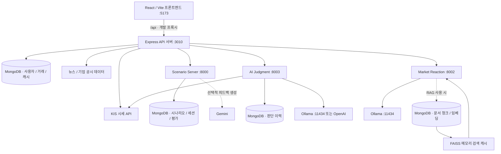

# ANTITUDE

**뉴스·시나리오 기반 주식 투자 판단 학습 플랫폼**

ANTITUDE는 시장 정보와 뉴스를 해석하고, 투자 행동의 근거를 세우고, 그 판단을 돌아보는 과정을 연습하는 금융 교육 프로젝트입니다. 국내·미국 주식 모의투자와 과거 금융 이벤트 시나리오를 제공하며, 규칙 기반 평가와 AI 해설을 통해 사용자의 판단 과정을 피드백합니다.

2026 Capstone Design · Team ANTITUDE

> 이 문서는 현재 저장소의 라우트, 설정, 서비스 구현을 기준으로 작성했습니다. 패키지 이름에는 초기 프로젝트명인 `stotra`가 남아 있고, 일부 서비스·DB 이름에는 `anttitude` 또는 `antitude_defense`가 사용됩니다. 실행 시에는 아래에 적힌 실제 이름을 사용합니다.

## 목차

- [프로젝트 목표](#프로젝트-목표)
- [주요 기능](#주요-기능)
- [시스템 구조](#시스템-구조)
- [기술 구성](#기술-구성)
- [저장소 구조](#저장소-구조)
- [로컬 실행](#로컬-실행)
- [환경 변수 안내](#환경-변수-안내)
- [주요 화면과 API](#주요-화면과-api)
- [데이터와 평가 흐름](#데이터와-평가-흐름)
- [빌드와 테스트](#빌드와-테스트)
- [뉴스 감성 분류 실험](#뉴스-감성-분류-실험)
- [문제 해결](#문제-해결)
- [현재 구현 범위와 제한](#현재-구현-범위와-제한)
- [상세 문서](#상세-문서)
- [라이선스](#라이선스)

## 프로젝트 목표

투자 초보자는 뉴스의 핵심 요인을 파악하거나, 호재의 선반영 여부와 위험을 함께 고려하거나, 자신의 매매 이유를 설명하는 데 어려움을 겪을 수 있습니다. ANTITUDE는 다음 학습 흐름을 제공합니다.

1. **정보 확인**: 시세, 차트, 뉴스, 시장 상황을 확인합니다.
2. **판단과 행동**: 매수·매도·관망을 결정하고 모의 주문을 실행합니다.
3. **근거 작성**: 시나리오의 객관식 질문과 자유서술에 답합니다.
4. **피드백 확인**: 요인 식별, 위험 인식, 논리와 행동의 일관성을 평가받습니다.
5. **반복 학습**: 다음 턴에서 이전 조언을 참고하고 진행도와 결과를 돌아봅니다.

시나리오의 **투자 판단 점수와 수익률은 별도 지표**입니다. 수익률을 판단 점수에 직접 더하지 않습니다.

## 주요 기능

### 1. 국내·미국 주식 모의투자

- 국내·미국 종목 검색, 현재가·과거 차트 조회
- 국내 종목 상세 정보와 호가 조회
- 시장가·지정가 주문, 미체결 주문 확인과 취소
- 사용자별 현금, 보유 종목, 평균 매입가, 평가 손익, 주문 이력 관리
- 국내 원화 계좌와 미국 달러 계좌 분리
- 시장 운영 상태 확인, 가상 자금 충전과 계좌 초기화
- 관심 종목 관리

현재 거래 서비스의 신규 계좌 잔액은 국내·미국 모두 **0**입니다. 가상 자금 충전 기능으로 시작하며, 1회 충전 단위는 국내 **1,000,000원**, 미국 **1,000달러**입니다. 시나리오 계좌의 초기 자산과는 별개입니다.

시세는 KIS Open API 등을 통해 조회하고, 모의 주문과 잔고는 애플리케이션에서 관리합니다. 실제 증권 계좌의 주문을 실행하는 흐름은 아닙니다.

### 2. 과거 금융 이벤트 시나리오

현재 Python 시나리오 서비스에 포함된 콘텐츠는 다음과 같습니다.

| 시나리오 ID | 제목 | 기간 | 턴 수 | 시작 자산 |
| --- | --- | --- | --- | --- |
| `semiconductor` | AI 반도체 랠리 — 좋은 뉴스에 올라타는 법 | 2024년 2~7월 | 6 | 현금 1,000만원 |
| `growth_rate_hike_2022` | 고금리 쇼크 — 물타기와 손절 사이 | 2022년 1~12월 | 5 | 현금 400만원 + NAVER 8주 + 카카오 15주 |
| `svb_bank_run_2023` | SVB 뱅크런 — 공포는 어디까지 번지는가 | 2023년 3월 | 4 | 현금 300만원 + KB금융 40주 + 신한지주 50주 + 은행 ETF 150주 |

각 턴에서 뉴스·시장 상황·차트를 확인하고 주문한 뒤, 객관식 5문항과 자유서술 1문항으로 판단 근거를 제출합니다. 마지막 턴 이후에는 지정된 최종 평가일의 종가로 보유 자산을 평가합니다.

| 평가 축 | 평가 내용 |
| --- | --- |
| M1 | 핵심 요인 식별 |
| M2 | 정보의 영향 방향과 의미 해석 |
| M3 | 위험·완화 요인·불확실성 인식 |
| M4 | 실제 주문과 작성한 근거의 정합성 |
| M5 | 원인 → 영향 → 행동의 논리 일관성 |
| PORTFOLIO | 현금 비중, 집중도 등 실제 포트폴리오 상태 |

이전 턴의 조언은 다음 턴에 다시 제공되며, 조언을 따랐는지·같은 문제를 반복했는지·확인하기 어려운지를 기록합니다. 코칭 이력은 피드백에 반영하고 별도의 중복 감점에는 사용하지 않습니다.

### 3. AI 판단과 사용자 판단 비교

`services/ai-judgment-service`는 종목별 시세 요인을 분석하고 매수·매도·관망 판단, 근거, 판단 이력을 제공합니다.

- 사용자가 보고 있는 종목을 동적으로 구독하고 시세를 REST 폴링합니다.
- 가격 변화, RSI, 거래량 등의 트리거 조건에 따라 판단을 갱신합니다.
- 사전 정의된 요인과 루브릭, TSK 퍼지 추론으로 판단 수치를 계산합니다.
- Ollama 또는 OpenAI가 판단 근거와 사용자 판단 비교 문장을 생성합니다.
- 판단 이력은 MongoDB에 저장합니다.

**판단 수치는 코드가 계산하고 LLM은 설명을 작성합니다.** 화면의 확률·신뢰도는 이 계산 결과이며, 실제 투자 성과의 검증된 예측 확률을 의미하지 않습니다.

### 4. 뉴스·이벤트 기반 시장 반응 분석

`simulator/market_reaction`은 선택 종목에 대한 뉴스나 사건을 입력받아 시장 참여자별 반응을 설명합니다.

- 개인·기관·외국인·단기·장기 투자자 5개 관점의 반응 분석
- 매수·매도·관망 압력, 시장 분위기, 분석 신뢰도, 불확실성 표시
- Node 서버에서 전달받은 시세를 분석 맥락에 반영
- DART·SEC EDGAR 공시를 검색하는 선택적 RAG 기능
- LLM 단계별 실패 시 해당 단계만 규칙 기반 처리로 대체

RAG는 문서를 청크로 나누고 Ollama 임베딩을 생성해 MongoDB에 저장한 뒤, 실행 중에는 FAISS 메모리 인덱스로 검색합니다. 분석 결과에는 사용한 근거 자료와 fallback 여부가 포함됩니다.

### 5. 금융 뉴스·사전·퀴즈·학습 진행도

- 전체 뉴스 및 종목별 관련 뉴스 조회
- JSON 콘텐츠를 사용하는 금융 용어 사전과 퀴즈
- 사용자별 퀴즈 풀이·완료 이벤트와 시나리오 진행도 기록
- 마이페이지에서 계좌·포트폴리오 및 학습 현황 확인
- 퀴즈 진행도 조회 실패 시 브라우저 로컬 캐시 사용

### 6. 호환성을 위해 유지된 기능

군 복무 프로필, 급여 계산·자산 배분, 커뮤니티 게시글·댓글·좋아요, 군종별 모의투자 순위 코드도 포함되어 있습니다. 급여·커뮤니티 화면은 현재 사이드바에서 숨겨져 있지만 관련 라우트와 서버·DB 구현은 유지됩니다.

## 시스템 구조



| 구성 요소 | 기본 포트 | 역할 | 실행 위치 |
| --- | --- | --- | --- |
| 프론트엔드 | `5173` | 사용자 화면, API 호출 | `app/` |
| Node API | `3010` | 인증, 거래, 시세, 뉴스, Python 서비스 프록시 | `server/` |
| 시나리오 서비스 | `8000` | 세션·주문·턴 진행·채점·학습 기록 | `services/scenario-server/` |
| 시장 반응 서비스 | `8002` | 뉴스·이벤트 분석, 투자자 반응, RAG | `simulator/market_reaction/` |
| AI 판단 서비스 | `8003` | 종목 감시, 판단 계산·비교·이력 | `services/ai-judgment-service/` |
| Ollama | `11434` | 로컬 LLM 및 임베딩 | 별도 실행 |

프론트엔드는 기본적으로 `/api` 상대 경로를 사용합니다. 개발 환경에서는 [Vite 설정](app/vite.config.js)이 이를 `http://0.0.0.0:3010`으로 전달합니다. Python 서비스 주소는 Node 서버 환경 변수에서 설정합니다.

## 기술 구성

| 영역 | 저장소에서 사용하는 기술 |
| --- | --- |
| 프론트엔드 | React 18, TypeScript 5, Vite 4, React Router 6 |
| UI | Chakra UI 2, Emotion, Framer Motion, React Icons |
| 차트 | Highcharts, Lightweight Charts, Recharts |
| API·인증 | Axios, Express 4, JWT, bcryptjs, Cloudflare Turnstile |
| Node 데이터 계층 | MongoDB, Mongoose 7, Node Cache |
| Python API | FastAPI, Uvicorn, Pydantic |
| Python 데이터 계층 | PyMongo, Motor — 서비스별 의존성 상이 |
| AI 해설 | Ollama, OpenAI SDK, Google GenAI SDK |
| 문서 검색 | FAISS, NumPy, Ollama `bge-m3`, Beautiful Soup |
| 외부 데이터 | KIS, 네이버 뉴스 검색, DART, SEC EDGAR, Yahoo Finance |
| 감성 분류 실험 | PyTorch, Transformers, Datasets, `snunlp/KR-FinBert-SC` |
| 검증·문서화 | unittest, pytest, Swagger UI, FastAPI OpenAPI |

정확한 버전은 각 서비스의 `package.json`, `package-lock.json`, `requirements.txt`를 기준으로 확인합니다.

## 저장소 구조

```text
stotra-main/
├─ app/                              # React 프론트엔드
│  ├─ public/                        # 로고, 아이콘, 시나리오 이미지
│  ├─ src/
│  │  ├─ App.tsx                     # 화면 라우트
│  │  ├─ components/                 # 차트, 거래, AI, 프로필, 시나리오 UI
│  │  ├─ pages/                      # 모의투자, 시나리오, 뉴스, 학습 등
│  │  ├─ layouts/                    # 공통 화면 레이아웃
│  │  ├─ services/                   # API, 인증 토큰, 학습 진행도
│  │  ├─ data/                       # 금융 용어·퀴즈·상수
│  │  ├─ types/                      # TypeScript 데이터 타입
│  │  └─ theme/                      # UI 테마
│  └─ vite.config.js                 # 개발 서버와 /api 프록시
├─ server/                           # Express API
│  ├─ .env.example
│  └─ src/
│     ├─ index.ts                    # 서버 시작, CORS, 요청 제한
│     ├─ routes.ts                   # API 라우트와 Python 프록시
│     ├─ controller/                 # 요청 검증과 응답 처리
│     ├─ services/                   # 거래, 시장 시간, 상세 정보, 캐시
│     ├─ models/                     # Mongoose 스키마
│     ├─ middleware/                 # JWT, 가입 검증
│     ├─ utils/                      # DB, KIS 요청, Swagger
│     ├─ data/                       # 종목·기존 시나리오 데이터
│     └─ scripts/                    # 시드 및 데이터 마이그레이션
├─ services/
│  ├─ scenario-server/
│  │  ├─ main.py                     # FastAPI 시작점
│  │  ├─ config.py                   # DB·LLM 설정
│  │  ├─ routes/                     # 플레이·채점·마이페이지 API
│  │  ├─ play/                       # 세션, 모의 호가, 주문, 최종 평가
│  │  ├─ scoring/                    # 규칙·서술 분석·피드백·턴 간 코칭
│  │  ├─ data/scenarios/             # 3개 시나리오 JSON 콘텐츠
│  │  ├─ scripts/                    # 콘텐츠 시드, 가격·시장 지표 적재
│  │  └─ tests/                      # 세션·체결·평가 테스트
│  └─ ai-judgment-service/
│     ├─ app/
│     │  ├─ api/                     # 판단·비교·이력·감시 API
│     │  ├─ marketdata/              # KIS 폴링, 지표, 초기 데이터
│     │  ├─ tracking/                # 종목 구독과 TTL
│     │  ├─ triggers/                # 재평가 조건
│     │  ├─ factors/                 # 요인 카탈로그와 매칭
│     │  ├─ scoring/                 # 루브릭, 퍼지 판단
│     │  ├─ narrative/               # LLM 제공자와 설명 프롬프트
│     │  ├─ history/                 # 변경 감지와 이력 저장
│     │  └─ db/                      # MongoDB와 카탈로그 시드
│     ├─ scripts/                    # 로컬 파이프라인 실행·시세 점검
│     └─ tests/
├─ simulator/
│  ├─ market_reaction/
│  │  ├─ app/core/                   # 입력 검증, 5개 에이전트, 압력·신뢰도
│  │  ├─ app/services/               # LLM, RAG, DART·EDGAR, MongoDB
│  │  ├─ app/schemas/                # 요청·응답 계약
│  │  ├─ scripts/build_rag_index.py  # 공시 수집·청킹·임베딩 저장
│  │  ├─ tests/                      # 오프라인 분석·검색·fallback 테스트
│  │  └─ docs/                       # API·프롬프트·설계 문서
│  ├─ scripts/                       # 뉴스 수집·감성 모델 학습·추론
│  ├─ agent-training/                # 뉴스 CSV 수집 실험
│  ├─ archive/simulator_hyunwoo/     # 과거 Mesa 시뮬레이터
│  ├─ requirements.txt               # 수집·기존 시뮬레이터 의존성
│  └─ requirements-train.txt         # 감성 분류 학습 의존성
├─ assets/                           # 기존 소개 이미지
├─ package.json                      # 루트 공통 도구 설정
└─ LICENSE
```

## 로컬 실행

### 1. 준비 사항

- Node.js와 npm: 백엔드의 내장 `fetch` 사용을 위해 Node.js 18 이상이 필요합니다. 저장소에 `engines` 버전 고정은 없습니다.
- Python 3.11: 아래 실행 예시와 기존 Windows 설치 스크립트의 기준 버전입니다.
- MongoDB: Node 서버는 현재 Atlas SRV 접속 방식으로 구현되어 있습니다.
- KIS API 키: 실제 시세 조회 및 KIS 과거 일봉 적재에 필요합니다.
- Turnstile 설정: 현재 로그인과 회원가입은 모두 서버에서 토큰을 검증합니다.
- Ollama 또는 외부 LLM 설정: 사용할 AI 기능에 맞춰 준비합니다.

**Python 서비스마다 별도의 가상환경을 사용합니다.** 예를 들어 AI 판단 서비스는 `pymongo==4.8.0`, 시장 반응 서비스는 `pymongo==4.17.0`을 지정하므로 모든 requirements를 하나의 환경에 설치하지 않습니다.

아래 명령은 **Windows PowerShell** 기준입니다. 각 절의 `cd`는 저장소 루트에서 시작합니다. Python은 가상환경의 실행 파일을 직접 호출하므로 활성화 스크립트를 실행하지 않아도 됩니다. macOS/Linux에서는 `py -3.11`을 `python3`, `.\.venv\Scripts\python.exe`를 `./.venv/bin/python`으로 바꿉니다.

### 2. 환경 파일 준비

저장소 루트에서 실행합니다. 기존 `.env`가 있으면 복사하지 않아 기존 설정을 보존합니다.

```powershell
if (!(Test-Path server/.env)) {
    Copy-Item server/.env.example server/.env
}
if (!(Test-Path services/scenario-server/.env)) {
    Copy-Item services/scenario-server/.env.example services/scenario-server/.env
}
if (!(Test-Path services/ai-judgment-service/.env)) {
    Copy-Item services/ai-judgment-service/.env.example services/ai-judgment-service/.env
}
if (!(Test-Path simulator/market_reaction/.env)) {
    Copy-Item simulator/market_reaction/.env.example simulator/market_reaction/.env
}
```

복사 후 [환경 변수 안내](#환경-변수-안내)에 따라 값을 채웁니다. 예제의 빈 값을 복사하는 것만으로 외부 API와 DB 연결이 완료되지는 않습니다.

### 3. Node API 설치·실행

```powershell
cd server
npm ci
npm run dev
```

- 기본 주소: `http://localhost:3010`
- API 문서: `http://localhost:3010/api/docs`
- `npm ci` 과정에서 `postinstall`의 TypeScript 컴파일이 함께 실행됩니다.
- 터미널의 서버 시작 메시지와 MongoDB 연결 성공 메시지를 모두 확인합니다.

### 4. 프론트엔드 설치·실행

새 터미널에서 실행합니다.

```powershell
cd app
npm ci
npm run dev
```

기본 접속 주소는 `http://localhost:5173`입니다. 포트가 사용 중이면 Vite 터미널에 출력된 실제 주소를 확인합니다. `/`는 로그인 상태에 따라 `/scenario` 또는 `/login`으로 이동합니다.

루트 `package.json`에는 전체 서비스를 실행하는 `dev` 스크립트나 npm workspace 설정이 없습니다. `app/`과 `server/`에서 각각 설치·실행합니다.

### 5. 시나리오 서비스 설치·데이터 준비·실행

```powershell
cd services/scenario-server
py -3.11 -m venv .venv
.\.venv\Scripts\python.exe -m pip install -r requirements.txt
```

`.env`의 MongoDB 연결 정보를 채운 후 콘텐츠를 적재합니다.

```powershell
.\.venv\Scripts\python.exe -m scripts.seed_database --scenario semiconductor
.\.venv\Scripts\python.exe -m scripts.seed_database --scenario growth_rate_hike_2022
.\.venv\Scripts\python.exe -m scripts.seed_database --scenario svb_bank_run_2023
```

시드는 시나리오·종목·뉴스·턴·루브릭 등을 upsert합니다. **과거 가격 데이터는 별도로 적재해야 합니다.** Yahoo Finance 보조 적재기를 사용하는 예시는 다음과 같습니다.

```powershell
.\.venv\Scripts\python.exe -m scripts.import_yahoo_prices --scenario semiconductor --start 20231101 --end 20240719
.\.venv\Scripts\python.exe -m scripts.import_yahoo_prices --scenario growth_rate_hike_2022 --start 20211201 --end 20221229
.\.venv\Scripts\python.exe -m scripts.import_yahoo_prices --scenario svb_bank_run_2023 --start 20230201 --end 20230407
```

외부 데이터 접근 상태에 따라 적재가 실패할 수 있습니다. KIS를 사용하려면 서비스의 `KIS_APP_KEY`, `KIS_APP_SECRET`을 설정한 뒤 해당 시나리오·기간으로 실행합니다.

```powershell
.\.venv\Scripts\python.exe -m scripts.import_kis_prices --scenario semiconductor --start 20231101 --end 20240719
```

직접 준비한 CSV도 적재할 수 있습니다. 열은 `asset_id,trade_date,open,high,low,close,volume`입니다. 다음 명령은 `prices.csv`를 준비한 경우에만 실행합니다.

```powershell
.\.venv\Scripts\python.exe -m scripts.import_prices_csv .\prices.csv --source MANUAL_CSV
```

가격 데이터가 없는 종목은 `data_available: false`로 표시되고 주문이 차단됩니다. 데이터를 준비한 후 서버를 실행합니다.

```powershell
.\.venv\Scripts\python.exe -m uvicorn main:app --host 127.0.0.1 --port 8000 --reload
```

### 6. AI 판단 서비스 설치·실행

```powershell
cd services/ai-judgment-service
py -3.11 -m venv .venv
.\.venv\Scripts\python.exe -m pip install -r requirements.txt
.\.venv\Scripts\python.exe -m app.db.seed_factors
.\.venv\Scripts\python.exe -m uvicorn app.main:app --host 127.0.0.1 --port 8003 --reload
```

시드 전 DB 설정이 필요합니다. `.env.example`을 복사한 기본 구성은 `LLM_PROVIDER=ollama`, `OLLAMA_MODEL=qwen3.5:4b`입니다. `.env` 없이 실행할 때의 코드 기본 제공자는 `openai`이므로 환경 파일을 확인합니다.

Windows에서는 같은 디렉터리의 `.\setup.bat`, `.\start.bat`도 사용할 수 있습니다. KIS 키가 없으면 서버 시작 시 시세 폴링을 켜지 않습니다.

### 7. 시장 반응 서비스 설치·실행

```powershell
cd simulator/market_reaction
py -3.11 -m venv .venv
.\.venv\Scripts\python.exe -m pip install -r requirements.txt
.\.venv\Scripts\python.exe -m uvicorn app.main:app --host 127.0.0.1 --port 8002 --reload
```

이 서비스는 정상 입력에 대해 Ollama 호출이 실패해도 규칙 기반 결과를 반환할 수 있습니다. 시세를 전달받지 못하면 샘플 시세인 `stub`을 사용하며 응답 메타데이터에 표시합니다.

### 8. 로컬 LLM과 RAG 준비

Ollama를 사용하는 기능에 맞춰 모델을 준비합니다. 다음 모델명은 현재 저장소 설정 기준입니다.

```powershell
ollama pull qwen3.5:4b
ollama pull llama3.1:8b
```

Ollama가 실행 중이 아니라면 별도 터미널에서 `ollama serve`를 실행합니다. AI 판단은 기본 예제에서 `qwen3.5:4b`, 시장 반응 분석은 `llama3.1:8b`를 사용합니다.

공시 RAG를 사용하려면 시장 반응 서비스의 DART 키와 MongoDB 설정을 채우고, `simulator/market_reaction/` 디렉터리에서 실행합니다.

```powershell
ollama pull bge-m3
.\.venv\Scripts\python.exe -m scripts.build_rag_index
```

이 명령은 공시를 외부에서 수집하고 임베딩을 생성해 MongoDB의 `rag_chunks`, `rag_manifest`에 저장합니다. RAG 데이터가 없으면 근거 문서 검색 없이 분석을 진행합니다. 인덱스를 다시 만든 후에는 이미 실행 중인 시장 반응 서비스를 재시작해 메모리 캐시를 갱신합니다.

### 9. 연결 확인

```powershell
Invoke-RestMethod http://127.0.0.1:8000/
Invoke-RestMethod http://127.0.0.1:8002/health
Invoke-RestMethod http://127.0.0.1:8003/health
Invoke-RestMethod http://localhost:3010/api/scenario-service/health
Invoke-RestMethod http://localhost:3010/api/ai-judgment/health
```

- 시나리오: 응답의 `data.database`가 `connected`인지 확인합니다. 최상위 `status: ok`만으로 DB 연결을 판정하지 않습니다.
- 시장 반응: `ollama`가 `connected`인지 확인합니다. `disconnected`여도 서비스 상태는 `ok`일 수 있습니다.
- AI 판단: `/health`는 API 프로세스 상태만 반환합니다. DB·KIS·LLM의 정상 동작은 실제 판단 요청으로 추가 확인합니다.

Python API 문서는 각각 `http://127.0.0.1:8000/docs`, `http://127.0.0.1:8002/docs`, `http://127.0.0.1:8003/docs`에서 확인할 수 있습니다.

## 환경 변수 안내

환경 파일은 **서비스별 디렉터리에서 로드**합니다. 실제 API 키·DB 비밀번호·JWT 비밀값을 README나 Git에 넣지 않습니다.

### Node API — `server/.env`

| 변수 | 용도 / 기본값 |
| --- | --- |
| `PORT` | API 포트, 기본 `3010` |
| `STOTRA_MONGODB_USERNAME` | Atlas DB 사용자, 필수 |
| `STOTRA_MONGODB_PASSWORD` | Atlas DB 비밀번호, 필수 |
| `STOTRA_MONGODB_CLUSTER` | Atlas 클러스터 호스트, 필수. `mongodb+srv://`와 사용자 정보는 제외 |
| `MONGO_DB_NAME` | DB 이름, 예제는 `antitude_defense` |
| `STOTRA_JWT_SECRET` | JWT 서명 비밀값 |
| `STOTRA_TURNSTILE_SECRET` | 로그인·회원가입 Turnstile 검증 |
| `SCENARIO_SERVICE_URL` | 기본 `http://127.0.0.1:8000` |
| `MARKET_REACTION_URL` | 기본 `http://127.0.0.1:8002` |
| `AI_JUDGMENT_SERVICE_URL` | 기본 `http://127.0.0.1:8003` |
| `STOTRA_KIS_APP_KEY`, `STOTRA_KIS_APP_SECRET` | KIS 시세 조회용 키. 예제 파일에는 없어 직접 추가 |
| `STOTRA_KIS_ENV` | KIS 환경, 기본 `real` |
| `STOTRA_KIS_BASE_URL` | KIS 기본 주소를 직접 지정할 때 사용 |
| `STOTRA_NAVER_CLIENT_ID`, `STOTRA_NAVER_CLIENT_SECRET` | 뉴스 검색. 각각 `NAVER_CLIENT_ID`, `NAVER_CLIENT_SECRET`도 대체 이름으로 지원 |
| `STOTRA_DART_API_KEY` | 국내 종목의 기업·재무 상세 조회 |
| `STOTRA_AI_USE_LLM` | Node 종목 도우미의 LLM 사용 여부. 예제는 `false` |
| `STOTRA_LLM_BASE_URL`, `STOTRA_LLM_MODEL` | Node 종목 도우미의 Ollama 주소·모델 |
| `KRX_CLOSED_DATES` | 국내 휴장일 추가 설정 |
| `US_CLOSED_DATES`, `US_EARLY_CLOSE_DATES` | 미국 휴장일·조기 종료일 설정 |
| `ALLOW_CLOSED_MARKET_ORDERS` | `true`이면 국내 장외 시간 주문 허용 설정 |
| `ALLOW_CLOSED_US_MARKET_ORDERS` | `true`이면 미국 장외 시간 주문 허용 설정 |

Node 본 서버의 DB 연결은 `MONGODB_URI` 또는 `MONGO_URI` 하나로 대체되지 않습니다. [db.ts](server/src/utils/db.ts)의 `STOTRA_MONGODB_*`와 `MONGO_DB_NAME`을 사용해야 합니다.

현재 로그인·회원가입 컴포넌트에는 Turnstile 테스트 사이트 키가 들어 있습니다. 로컬에서는 이에 맞는 테스트 검증 설정을 사용하고, 배포 시에는 프론트 사이트 키와 서버 비밀키를 함께 배포 환경에 맞게 설정해야 합니다. 해당 키는 현재 `VITE_*` 환경 변수로 분리되어 있지 않습니다.

### 시나리오 서비스 — `services/scenario-server/.env`

| 변수 | 용도 / 기본값 |
| --- | --- |
| `DATA_BACKEND` | 기본 `mongodb`, 자동 테스트용 `memory` 지원 |
| `MONGODB_URI` | 기본 `mongodb://127.0.0.1:27017`, Atlas URI도 직접 지정 가능 |
| `MONGODB_DATABASE` | 기본 `anttitude_scenario` |
| `MONGODB_CONNECT_TIMEOUT_MS` | 기본 `3000` |
| `GEMINI_API_KEY` | 선택적 피드백 문장 생성 |
| `KIS_APP_KEY`, `KIS_APP_SECRET` | 과거 일봉 적재용 키 |
| `KIS_ENV` | 기본 `real` |
| `DEFAULT_USER_ID` | 로컬 테스트 기본 사용자, `beta-user` |

시나리오 서비스는 Node의 Atlas 설정을 자동 재사용하지 않습니다. 같은 클러스터를 사용할 때도 `MONGODB_URI`를 직접 지정합니다. `memory` 저장소는 프로세스가 종료되면 사라지므로 별도 프로세스에서 실행한 시드 결과를 서버로 전달하는 용도로 사용할 수 없습니다.

### AI 판단 서비스 — `services/ai-judgment-service/.env`

| 변수 | 용도 / 기본값 |
| --- | --- |
| `LLM_PROVIDER` | `ollama` 또는 `openai`. 예제는 `ollama` |
| `OLLAMA_BASE_URL`, `OLLAMA_MODEL` | 예제는 `http://127.0.0.1:11434`, `qwen3.5:4b` |
| `OPENAI_API_KEY`, `OPENAI_MODEL` | OpenAI 제공자를 선택할 때 사용. 모델 기본값은 `gpt-4o` |
| `MONGO_URI` | 명시하면 우선 사용 |
| `MONGO_DB_NAME` | 서비스 예제는 `anttitude_ai_judgment` |
| `KIS_APP_KEY`, `KIS_APP_SECRET` | 종목 감시 시세 조회 |
| `KIS_BASE_URL` | 기본값은 KIS 모의투자 도메인 |
| `POLL_INTERVAL_SEC` | 기본 시세 폴링 간격 `10`초 |
| `WATCH_TTL_SEC` | 종목 구독 유지 시간, 기본 `60`초 |
| `TRIGGER_COOLDOWN_SEC` | 같은 종목 재평가 최소 간격, 기본 `300`초 |

이 서비스는 `../../server/.env`를 먼저 읽고 자신의 `.env`로 덮어씁니다. `MONGO_URI`가 비어 있으면 Node의 Atlas 계정을 재사용하고, 그 값도 없으면 로컬 MongoDB를 사용합니다. DB 분리를 위해 서비스의 `MONGO_DB_NAME`을 명시합니다.

Node의 `STOTRA_KIS_APP_KEY`와 Python의 `KIS_APP_KEY`는 이름이 다릅니다. Node 환경 파일에 키가 있다는 이유만으로 Python 시세 조회까지 설정되지는 않습니다.

### 시장 반응 서비스 — `simulator/market_reaction/.env`

| 변수 | 용도 / 기본값 |
| --- | --- |
| `OLLAMA_HOST` | 기본 `http://127.0.0.1:11434` |
| `OLLAMA_MODEL` | 기본 `llama3.1:8b` |
| `OLLAMA_TIMEOUT_SECONDS` | 기본 `120` |
| `OLLAMA_MAX_RETRIES` | 기본 `1` |
| `OLLAMA_TEMPERATURE` | 기본 `0.3` |
| `OLLAMA_EMBEDDING_MODEL` | 기본 `bge-m3` |
| `DART_API_KEY` | RAG 공시 수집 배치용 |
| `STOTRA_MONGODB_USERNAME`, `STOTRA_MONGODB_PASSWORD`, `STOTRA_MONGODB_CLUSTER` | RAG 저장소 접속 정보 |
| `MONGO_DB_NAME` | RAG 컬렉션을 저장·조회할 DB |
| `RAG_MAX_CACHED_STOCKS` | FAISS 종목 캐시 수 제한, 빈 값이면 제한 미설정 |

시장 반응 서비스의 RAG 설정은 자신의 `.env`에 입력합니다. `API_HOST`, `API_PORT` 설정 필드도 있지만 위 실행 명령의 실제 바인딩 주소와 포트는 Uvicorn의 `--host`, `--port` 인자가 결정합니다.

## 주요 화면과 API

### 프론트엔드 라우트

| 경로 | 화면 |
| --- | --- |
| `/login`, `/signup` | 로그인·회원가입 |
| `/mypage` | 사용자·포트폴리오·학습 현황 |
| `/exchange` | 국내·미국 모의투자 |
| `/stocks/:symbol` | 종목 상세 |
| `/scenario` | 시나리오 목록과 진행도 |
| `/scenario/chapter/:chapterId` | 챕터별 시나리오 화면 |
| `/scenario/play/:scenarioId` | 시나리오 플레이 |
| `/ai-judgment` | AI 판단 화면 |
| `/simulator` | 시장 반응 분석 |
| `/news` | 금융 뉴스 |
| `/learn` | 금융 사전·퀴즈 |
| `/learning`, `/finance-learning`, `/dictionary`, `/quiz` | 동일 학습 화면의 별칭 |
| `/salary`, `/salary-planner` | 기존 급여·자산 배분 화면 |
| `/community`, `/community/write`, `/community/:postId` | 기존 커뮤니티 화면 |

현재 사이드바는 마이페이지, 실시간 차트, 과거 시나리오, 실시간 뉴스, 금융 사전퀴즈 중심입니다. AI 판단과 시장 반응 패널은 국내 거래 화면에서도 사용합니다.

### Node API 대표 경로

다음 경로는 모두 `server/src/routes.ts`에 정의되어 있습니다. 보호된 계좌·사용자 API는 `Authorization: Bearer <accessToken>`을 사용합니다. 인증 적용 여부는 라우트별로 다릅니다.

| 기능 | 메서드·경로 |
| --- | --- |
| 인증 | `POST /api/auth/signup`, `POST /api/auth/login` |
| 관심 종목 | `GET /api/user/watchlist` |
| 국내 검색·시세 | `GET /api/stocks/search/:query`, `GET /api/stocks/:symbol/info` |
| 국내 차트·상세·호가 | `GET /api/stocks/:symbol/historical`, `GET /api/stocks/:symbol/detail`, `GET /api/stocks/:symbol/orderbook` |
| 시장 운영 상태 | `GET /api/markets/KRX/status`, `GET /api/markets/US/status` |
| 국내 계좌·포트폴리오 | `GET /api/trading/account`, `GET /api/trading/portfolio` |
| 국내 주문 조회·생성 | `GET /api/trading/orders`, `POST /api/trading/orders` |
| 국내 주문 취소 | `POST /api/trading/orders/:orderId/cancel` |
| 국내 자금 충전·초기화 | `POST /api/trading/top-up`, `POST /api/trading/reset` |
| 미국 종목 검색 | `GET /api/us-stocks/search/:query` |
| 미국 시세·차트 | `GET /api/us-stocks/:exchange/:symbol/info`, `GET /api/us-stocks/:exchange/:symbol/historical` |
| 미국 계좌·포트폴리오 | `GET /api/us-trading/account`, `GET /api/us-trading/portfolio` |
| 미국 주문 조회·생성 | `GET /api/us-trading/orders`, `POST /api/us-trading/orders` |
| 미국 주문 취소 | `POST /api/us-trading/orders/:orderId/cancel` |
| 미국 자금 충전·초기화 | `POST /api/us-trading/top-up`, `POST /api/us-trading/reset` |
| 뉴스 | `GET /api/news`, `GET /api/news/:symbol` |
| 시나리오 목록·세션 시작 | `GET /api/scenario-service/scenarios`, `POST /api/scenario-service/scenarios/:scenarioId/sessions` |
| 현재 턴 | `GET /api/scenario-service/sessions/:sessionId/turn` |
| 시나리오 주문 | `POST /api/scenario-service/sessions/:sessionId/orders` |
| 턴 제출 | `POST /api/scenario-service/sessions/:sessionId/turn/submit` |
| 결과·최종화 | `GET /api/scenario-service/sessions/:sessionId/result`, `POST /api/scenario-service/sessions/:sessionId/finalize` |
| 시나리오 진행도 | `GET /api/scenario-service/users/:userId/scenario-progress` |
| 퀴즈 진행도 | `GET /api/scenario-service/users/:userId/quiz-progress` |
| 퀴즈 이벤트 | `POST /api/scenario-service/users/:userId/quiz-progress/events` |
| AI 판단·이력 | `GET /api/ai-judgment/:symbol`, `GET /api/ai-judgment/:symbol/history` |
| AI 종목 감시 시작·해제 | `POST /api/ai-judgment/:symbol/watch`, `DELETE /api/ai-judgment/:symbol/watch` |
| 사용자 판단 비교 | `POST /api/ai-judgment/compare` |
| 시장 반응 분석 | `POST /api/market-reaction/simulate` |

기존 Node 시나리오 API인 `/api/scenarios/*`와 Python 플레이용 `/api/scenario-service/*`는 별도 구현입니다. 현재 시나리오 목록·플레이는 Python 서비스 흐름을 기준으로 준비합니다.

Python에 있는 모든 API가 Node에 프록시되어 있지는 않습니다. 예를 들어 시나리오의 개별 호가 조회, 평가 목록·상세, 행동 프로필 경로는 Python 서비스 문서와 Node 라우트 양쪽을 확인해야 합니다.

### 시장 반응 요청 예시

Node의 `POST /api/market-reaction/simulate`에 보내는 JSON 예시입니다.

```json
{
  "user_id": "local-demo-user",
  "selected_stock": {
    "code": "000660",
    "name": "SK하이닉스"
  },
  "input_text": "SK하이닉스의 HBM 공급 확대가 반도체 산업과 투자자 심리에 어떤 영향을 줄 수 있는지 분석해 주세요."
}
```

Node가 가능한 경우 시세를 추가하고 Python의 `/simulate`로 전달합니다. 정상 분석과 LLM fallback은 `200`, 부적절한 입력은 `422`, Python 연결 실패는 Node에서 `503`으로 반환합니다. 빈 입력은 Node에서 `400`으로 거절합니다.

## 데이터와 평가 흐름

### 모의투자

```text
로그인 → JWT 발급 → 종목·시세 조회 → 가상 자금 충전
       → 주문 검증 → 체결 또는 미체결 상태 관리
       → 보유 종목·계좌·거래 이력 갱신 → 포트폴리오 조회
```

Mongoose 모델에는 사용자, 국내·미국 계좌, 보유 종목, 주문, 자금 이동, 월별 성과, 시세·차트·종목 상세 캐시 등이 정의되어 있습니다.

### 시나리오 학습

```text
JSON 콘텐츠 시드 + 실제 과거 가격 적재
    → 사용자 세션 생성
    → 턴 뉴스·시장 상황·종목 조회
    → 모의 호가 주문·체결
    → 객관식·자유서술 제출
    → M1~M5·PORTFOLIO 평가 + 코칭 피드백
    → 다음 턴 또는 최종 자산 평가·행동 프로필 집계
```

- M1~M3은 객관식 45%와 자유서술 분석 55%를 결합합니다.
- M4는 서술과 실제 행동의 정합성 55%, 행동 적합도 25%, 객관식 20%를 결합합니다.
- M5는 서술의 논리 연결을 평가합니다.
- 기본 축 가중치는 M1 20%, M2 18%, M3 18%, M4 17%, M5 12%, PORTFOLIO 15%이며, 루브릭 설정이 있으면 해당 설정을 사용합니다.
- 의미 없는 서술에는 품질 제한을 적용하며, 수익률은 별도 결과로 계산합니다.
- Gemini는 선택적으로 피드백 문장을 작성합니다. 호출 실패 시에도 규칙 기반 피드백으로 진행합니다.

### AI 판단

```text
종목 구독 → KIS 시세 폴링 → 트리거 확인 → 요인 매칭
         → 루브릭 가중치·퍼지 판단 계산 → LLM 설명 → MongoDB 이력 저장
```

판단 이력은 `judgment_history`, 카탈로그 시드 데이터는 `factor_catalog`에 저장합니다. 폴링과 판단 재실행은 서로 다른 간격·조건으로 제어합니다.

### 시장 반응과 RAG

```text
입력 검증 → 시세·공시 맥락 구성 → 5개 투자자 관점 분석
         → 일관성 점검 → 시장 압력·분위기 계산 → 종합 설명·신뢰도 계산
```

시장 압력·분위기·신뢰도는 코드로 계산합니다. 분석 결과는 현재 저장하지 않으며 `meta.db_save_status`는 `not_used`입니다. MongoDB를 사용하는 부분은 공시 RAG 저장·검색이며, 분석 이력 저장과 구분됩니다.

## 빌드와 테스트

아래 명령은 해당 디렉터리에 의존성을 설치한 후 실행합니다. README에 명령을 기재한 것은 현재 환경에서 모든 빌드·테스트가 통과했다는 의미가 아닙니다.

| 작업 | 실행 위치 | 명령 |
| --- | --- | --- |
| 프론트 빌드 | `app/` | `npm run build` |
| 프론트 미리보기 | `app/` | `npm run preview` |
| 프론트 린트 | `app/` | `npm run lint` |
| 프론트 타입 검사 | `app/` | `npx tsc --noEmit` |
| Node 컴파일 | `server/` | `npm run tsc` |
| 컴파일된 Node 실행 | `server/` | `npm start` |
| 시나리오 테스트 | `services/scenario-server/` | `.\.venv\Scripts\python.exe -m unittest discover -v -s tests` |
| AI 판단 테스트 | `services/ai-judgment-service/` | `.\.venv\Scripts\python.exe -m pytest tests` |
| 시장 반응 테스트 | `simulator/market_reaction/` | `.\.venv\Scripts\python.exe -m pytest tests` |

프론트의 `build`는 `vite build`로 정의되어 있어 TypeScript 타입 검사와 별개입니다. Node에는 현재 `npm test` 스크립트가 없습니다.

시나리오 테스트는 메모리 저장소로 주문·턴 진행·최종 평가·서술 채점·코칭을 확인합니다. 시장 반응 테스트는 외부 LLM·검색 등을 대체해 API, fallback, RAG 동작을 검증합니다. 실제 외부 API 연결과 전체 화면 연동은 별도로 확인해야 합니다.

AI 판단 서비스에는 서버를 띄우지 않고 파이프라인을 호출하는 도구도 있습니다. 다음 명령은 해당 서비스 디렉터리에서 실행하며, 샘플 시세를 사용하지만 **DB에 판단을 저장하고 설정한 LLM을 호출**합니다.

```powershell
.\.venv\Scripts\python.exe -m scripts.run_local judge --symbol 011070
.\.venv\Scripts\python.exe -m scripts.run_local compare --symbol 011070 --user-judge 매수
```

## 뉴스 감성 분류 실험

`simulator/scripts/`에는 웹 서비스와 별도로 한국어 금융 뉴스의 긍정·중립·부정 분류를 실험하는 도구가 있습니다.

| 파일 | 역할 |
| --- | --- |
| `collect_naver_news.py` | 네이버 API 기반 뉴스 수집 |
| `split_dataset.py` | 라벨 데이터 정리 및 학습·검증·테스트 분할 |
| `train_sentiment.py` | KR-FinBert-SC 기반 분류 모델 학습 |
| `predict_sentiment.py` | 학습된 모델로 문장 추론 |
| `predict_csv_sentiment.py` | CSV 데이터 일괄 추론 |
| `compare_predictions.py` | 예측 결과 비교 |

기본 분할 입력은 `simulator/data/labeled/korean_fin_news_labeled.csv`이며 `text`, `sentiment` 열을 사용합니다. `negative`, `neutral`, `positive`를 각각 `0`, `1`, `2`로 변환하고 기본 비율 70%·15%·15%로 분할합니다.

학습 코드는 `simulator/data/processed/{train,val,test}.csv`를 읽고 모델을 `simulator/outputs/kr-finbert-sc-sentiment/`에 저장합니다. 학습 의존성은 `simulator/requirements-train.txt`에 있습니다. 데이터와 학습 가중치는 직접 준비해야 하며, 이 실험을 먼저 실행해야 웹 서비스를 사용할 수 있는 것은 아닙니다.

## 문제 해결

| 증상 | 확인할 내용 |
| --- | --- |
| 루트에서 `npm run dev`가 실패함 | `app/`과 `server/`에서 각각 실행 |
| Node 시작 시 DB 변수 누락 오류 | `server/.env`의 Atlas 변수 3개와 `MONGO_DB_NAME` 확인 |
| 서버는 열렸지만 사용자 데이터 요청이 실패함 | 실제 MongoDB 연결 결과, DB 계정 권한·네트워크 접근 설정 확인 |
| 로그인·회원가입 Turnstile 오류 | 프론트 사이트 키와 서버 비밀키의 테스트/운영 구성 일치 여부 확인 |
| 시나리오 목록이 비어 있음 | `DATA_BACKEND`, DB 이름, 3개 시나리오 콘텐츠 시드 확인 |
| 시나리오 종목에 가격이 없거나 주문 불가 | 해당 종목과 턴·최종 평가일을 포함하는 과거 가격 적재 여부 확인 |
| 시나리오·AI 프록시가 `502` 반환 | Python 서비스 실행 여부와 Node의 서비스 URL 확인 |
| 시장 반응 API가 `503` 반환 | `8002` 서비스 연결과 Node의 120초 요청 제한 확인 |
| AI 판단이 생성되지 않음 | 서비스의 KIS 키, 종목 구독, DB, LLM 모델·제공자 설정 확인 |
| 시장 반응 결과에 `fallback` 또는 `stub` 표시 | Ollama 모델·연결, KIS 시세 전달 여부 확인 |
| 공시 근거가 비어 있음 | RAG 지원 종목, MongoDB 데이터, 임베딩 모델·차원, 인덱스 생성 여부 확인 |
| RAG 재생성 후 이전 자료가 보임 | 시장 반응 서비스를 재시작해 종목별 메모리 캐시 갱신 |
| Python에서 엉뚱한 `app` 모듈이 실행됨 | 해당 서비스 디렉터리에서 전용 가상환경의 Python으로 실행 |
| Python 의존성 충돌 | 서비스마다 `.venv`를 분리하고 해당 requirements만 설치 |
| 장외 시간 주문이 거절됨 | 시장 상태 API와 휴장일·개발용 주문 허용 설정 확인 |
| 프론트에서 API에 연결하지 못함 | Node 포트와 Vite 프록시 대상 일치 여부 확인. 로컬 주소 해석 문제 시 `127.0.0.1:3010` 사용 검토 |

## 현재 구현 범위와 제한

- **시나리오 호가는 모의 데이터입니다.** 일봉 종가·거래량으로 10단계 호가를 생성합니다. 실제 과거 호가 복원 데이터가 아니며 `SIMULATED_FROM_DAILY_OHLCV`로 표시합니다. 지정가의 미체결 잔량은 IOC 방식으로 즉시 취소합니다.
- **시나리오 인증 통합은 추가 작업이 필요합니다.** 현재 요청의 `user_id`를 사용하는 경로가 있으므로 Node의 JWT 보호 API와 같은 수준으로 인증되었다고 가정하면 안 됩니다.
- **시장 반응 분석 이력 조회는 미구현입니다.** Python의 `GET /simulations/{simulation_id}`는 `501`을 반환합니다.
- **AI 판단과 시장 반응 분석은 별도 기능입니다.** 두 서비스의 모델, 입력, 계산 방식, 장애 처리 방식이 다르며 한쪽의 fallback 정책을 다른 쪽에 적용해 이해하면 안 됩니다.
- **기존 시나리오 시드 명령은 신규 플레이 준비용이 아닙니다.** Node의 `npm run seed:scenarios`는 별도 `MONGO_URI`를 사용하고 기존 Scenario 문서를 삭제한 뒤 넣습니다. 현재 플레이 데이터는 Python의 `scripts.seed_database`로 준비합니다.
- **과거 Mesa 시뮬레이터는 보관 코드입니다.** `/api/simulator/run-visual` 프록시는 남아 있지만 현재 시장 반응 기능은 `/api/market-reaction/simulate`를 사용합니다. 기존 프록시의 `STOTRA_SIMULATOR_URL` 기본 포트 `8000`은 시나리오 서버와 겹치므로 별도 실험 시 주소를 분리해야 합니다.
- **과거 화면 파일이 모두 현재 메뉴에 연결된 것은 아닙니다.** 실제 접근 경로는 `app/src/App.tsx`와 사이드바 구성을 기준으로 확인합니다.
- **통합 배포 스크립트는 없습니다.** 현재 저장소에는 전체 서비스용 Docker Compose나 통합 시작 명령이 없습니다. 프론트 배포 시 SPA 경로 처리와 `/api` 리버스 프록시를 별도로 구성해야 합니다. Vite 개발 프록시는 정적 빌드에 포함되지 않습니다.
- **시세·뉴스·LLM·공시 수집은 외부 서비스 상태에 영향을 받습니다.** 실제 데이터와 샘플·fallback 결과를 응답의 출처·상태 필드로 구분합니다.

## 상세 문서

| 문서 | 내용 |
| --- | --- |
| [시나리오 서비스 README](services/scenario-server/README.md) | 콘텐츠 적재, 플레이 API, 호가·채점·코칭 |
| [시나리오 데이터 스키마](services/scenario-server/SCHEMA.md) | 데이터 모델과 저장 구조 |
| [시나리오 프론트 연동 가이드](services/scenario-server/API_FRONTEND_GUIDE.md) | 화면 연동용 요청·응답 안내 |
| [AI 판단 서비스 README](services/ai-judgment-service/README.md) | 설치, 판단·비교·이력, 로컬 실행 |
| [AI 판단 설계 개요](services/ai-judgment-service/docs/PAPER_AI_JUDGMENT_OVERVIEW.md) | 판단 파이프라인 설계 |
| [시장 반응 서비스 README](simulator/market_reaction/README.md) | 입력·출력, fallback, RAG |
| [시장 반응 백엔드 명세](simulator/market_reaction/docs/market_reaction_backend_spec.md) | API 계약과 계산 구조 |
| [시장 반응 프롬프트 명세](simulator/market_reaction/docs/prompts_spec.md) | 단계별 프롬프트 |
| [시장 반응 fallback 규칙](simulator/market_reaction/docs/fallback_rules.md) | 규칙 기반 대체 처리 |
| [RAG MongoDB 전환 기록](simulator/market_reaction/docs/RAG_MONGODB_MIGRATION_REPORT.md) | MongoDB 저장소와 FAISS 캐시 |
| [시장 반응 설계 개요](simulator/market_reaction/docs/PAPER_MARKET_REACTION_OVERVIEW.md) | 분석 구조와 교육적 활용 |

서비스별 문서에는 이전 개발 단계의 설명이 남아 있을 수 있습니다. 설정 기본값과 실제 지원 경로는 각 서비스의 현재 설정 파일·라우트·스키마를 함께 확인합니다.

## 라이선스

이 저장소에는 [MIT License](LICENSE)가 포함되어 있으며, 원저작권 표기는 `Copyright (c) 2023 spikecodes`입니다. 배포·재사용 시 기존 라이선스와 저작권 고지를 유지합니다. 외부 데이터·모델·라이브러리는 각 제공자의 이용 조건을 따릅니다.
